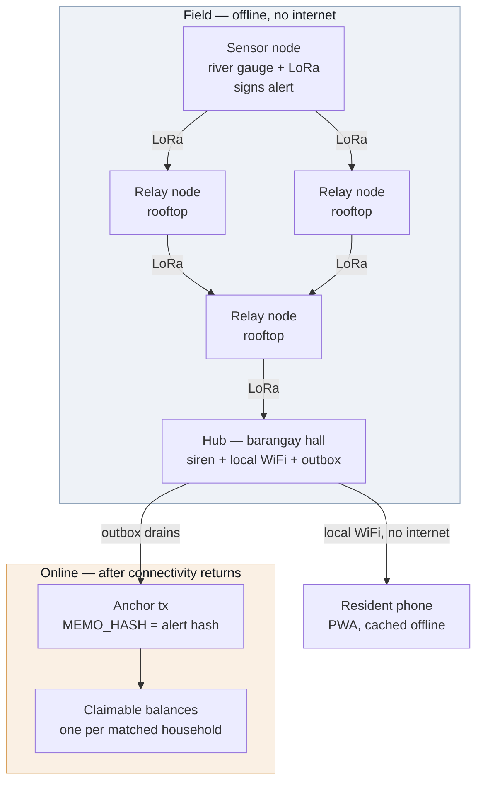

# LIGTAS — Product Requirements Document

*LoRa-Integrated Grassroots Typhoon Alert System*

Track: Climate Resilience and Hydrometeorological Disaster Management
Stage 2 · Blueprint
Version 0.1 · Draft

This document is the system design for the concept set out in [README.md](README.md). The README states the problem and the pitch; this document states what gets built, how the pieces fit, and what "done" means at each stage.

---

## 1. Summary

LIGTAS is a barangay-scale flood warning network of about five solar-powered LoRa radio nodes. When a river crosses a threshold, a sensor node signs an alert packet and broadcasts it; relay nodes verify the signature offline and rebroadcast it; a hub at the barangay hall sounds a siren and serves purok-specific evacuation instructions over its own WiFi with no internet involved. When connectivity returns, the hub anchors each alert's hash to Stellar as a tamper-evident record and releases pre-funded parametric payouts to registered households in the affected puroks.

The siren covers the barangay by sound, but the phone-level instruction screen does not: the hub's WiFi reaches only 50–100 m, so only residents within that radius of a hub can pull up their purok-specific page. This is a hard ceiling on phone reach, not a software gap — a spread-out barangay needs multiple hubs to close it (see [Cost](README.md#cost) and [Known limitations](README.md#known-limitations) in the README).

The design principle that governs every decision below: **warning delivery must work with zero connectivity, and nothing on the warning path may depend on the network.** Blockchain is the receipt book and the payment rail, never the delivery channel.

---

## 2. Goals and non-goals

### Goals

| # | Goal | Measured by |
|---|---|---|
| G1 | Deliver a signed alert across a multi-hop mesh with no internet | Alert reaches hub through ≥5 hops in simulation, end to end |
| G2 | Reject forged and replayed alerts at every hop | Forged packet and replayed packet both dropped at first relay |
| G3 | Survive node failure without losing the alert | Alert still reaches hub after a relay node is killed mid-run |
| G4 | Show a resident the instruction for *their* purok, offline | PWA loads from cache with the device in airplane mode |
| G5 | Produce a tamper-evident public record of every alert | Alert hash visible on Stellar Expert, matches locally recomputed hash |
| G6 | Release a parametric payout without human adjudication | Claimable balance created for a registered account, no manual step |

### Non-goals

Explicitly out of scope for this hackathon. Named here so scope creep is visible when it happens.

- Multi-barangay federation or inter-barangay alert routing
- Native mobile application (the PWA is the only client)
- PAGASA or any external weather API integration
- LGU enrollment workflow or registry administration UI
- Soroban smart contracts, or any Rust component
- Physical hardware procurement, assembly, or field RF testing
- Mainnet deployment

---

## 3. Users

| User | Context | What they need |
|---|---|---|
| **Resident** | Storm conditions, phone possibly offline, possibly no signal for days | A siren they can hear, and one screen *on their own phone* telling them where to go from *their* purok |
| **Barangay captain / authorised issuer** | Holds the signing key; legally accountable for warnings | Confidence that only they can issue an alert, and a record proving they did |
| **Hub operator (BDRRMC staff)** | Operates the hall node before and during an event | Alerts queue reliably and drain when the line comes back, with no data loss |
| **Auditor / LGU / COA** | Post-event, possibly adversarial | An independent record of what was issued and when, and where the money went |

---

## 4. System architecture



### Layer responsibilities

**L1 — Sensor node.** Reads water level, detects threshold crossing, builds and signs the alert packet, transmits. Debounces so a fluctuating reading does not emit a burst of alerts. Simulated in Wokwi (ESP32, Arduino C++).

**L2 — Relay nodes.** Verify signature offline against a cached authorised-issuer list, apply replay and duplicate rules, rebroadcast if the packet is new and valid. No state beyond the per-issuer sequence table and a short-lived seen-hash set. Simulated in Meshtasticator.

**L3 — Hub.** Verifies independently (does not trust that relays verified), fires the siren, updates the locally served PWA payload, and writes the alert to the SQLite outbox. Node + Express + `better-sqlite3`.

**L4 — Reconnection.** A drain worker anchors queued alerts to Stellar and creates claimable balances for matching households. Idempotent and safe to interrupt.

**L5 — Registry.** Off-chain, populated before any disaster: household ID → purok → Stellar address. Lives in the hub's SQLite database.

---

## 5. Alert packet specification

The alert is the core artifact of the entire system. It must be small enough for a LoRa payload, verifiable with no network, and stable enough to hash into a permanent record.

### 5.1 Wire format

A packet is a 20-byte signed body followed by a 64-byte Ed25519 signature — **84 bytes total**, comfortably inside Meshtastic's payload limit.

| Offset | Size | Field | Type | Notes |
|---|---|---|---|---|
| 0 | 1 | `version` | uint8 | `1` for this spec |
| 1 | 1 | `hazard` | uint8 | `1` river flood, `2` flash flood, `3` storm surge, `0` test |
| 2 | 1 | `severity` | uint8 | Tier `1`–`3` |
| 3 | 1 | `issuerIndex` | uint8 | Index into the cached authorised-issuer list |
| 4 | 4 | `purokBitmap` | uint32 BE | Bit *n* set = purok *n+1* affected; supports 32 puroks |
| 8 | 4 | `issuedAt` | uint32 BE | Unix seconds |
| 12 | 4 | `sequence` | uint32 BE | Per-issuer, strictly increasing |
| 16 | 2 | `waterLevelCm` | uint16 BE | Reading that triggered the alert; evidence, not a trigger input |
| 18 | 2 | `reserved` | uint16 BE | Zero; reserved for future fields |
| 20 | 64 | `signature` | bytes | Ed25519 over bytes `[0, 20)` |

Encoded and decoded with `DataView` in `packages/core`, big-endian throughout, no JSON and no schema library on the wire.

`issuerIndex` rather than a full 32-byte public key: the authorised-issuer list is provisioned to every node before deployment, so one byte identifies the signer and saves 31 bytes of airtime. The trade-off is that a node with a stale list cannot verify a newly added issuer — accepted, since issuer changes are rare and provisioned deliberately. **Open question:** whether to also carry a 4-byte key-fingerprint hint so a stale node can at least log *which* unknown issuer it rejected.

### 5.2 Alert identity

```
alertHash = SHA-256( body[0..20) )
```

32 bytes, which is exactly the size of a Stellar `MEMO_HASH`. The same hash is the outbox primary key, the deduplication key in the mesh, and the on-chain anchor value. One identifier throughout the system, derivable offline by anyone holding the packet.

### 5.3 Signing and verification

Per the project's key design rule, Stellar keypairs *are* the alert identity — there is no separate PKI.

- Sign: `Keypair.signMessage(body)` from `@stellar/stellar-sdk/base` (SEP-53)
- Verify: `Keypair.fromPublicKey(issuerPubkey).verifyMessage(body, signature)`

`packages/core` imports only the `/base` subpath. It must never import Horizon or any RPC client — a network import in this package would break the offline threat model, and the rule is enforced by review and by a dependency check in CI.

### 5.4 Replay, duplicate, and staleness rules

A multi-hop mesh means the *same* alert legitimately arrives several times by different paths. Duplicate suppression and replay defence are therefore separate mechanisms, and conflating them would either break propagation or open a replay hole.

Each node keeps two pieces of state:

1. `lastSeq[issuerIndex]` — highest sequence number accepted from that issuer
2. `seenHashes` — set of `alertHash` values seen recently, with a TTL

On receiving a packet:

| Condition | Action |
|---|---|
| Signature invalid | Drop, count as `rejected_signature` |
| `issuerIndex` not in cached list | Drop, count as `rejected_unknown_issuer` |
| `alertHash` in `seenHashes` | Drop silently — normal mesh duplicate, not an attack |
| `sequence` < `lastSeq[issuer]` | Drop, count as `rejected_replay` |
| `sequence` ≥ `lastSeq[issuer]`, hash unseen | **Accept**: rebroadcast, add hash to `seenHashes`, set `lastSeq` |

Clock trust is deliberately excluded from the accept decision. Field nodes have no NTP and will drift; `issuedAt` is recorded and anchored as the issuer's claim of time, but a node never rejects a packet for a timestamp it cannot independently verify. Sequence number is the sole ordering defence. **Open question:** whether the hub — which does eventually see real time — should flag alerts whose `issuedAt` diverges wildly from their arrival time, as a monitoring signal rather than a drop rule.

---

## 6. Hub

### 6.1 Outbox schema

```sql
CREATE TABLE alerts (
  alert_hash     TEXT PRIMARY KEY,   -- hex SHA-256 of the signed body
  body           BLOB NOT NULL,      -- 20 bytes, verbatim
  signature      BLOB NOT NULL,      -- 64 bytes
  issuer_pubkey  TEXT NOT NULL,      -- G... address, resolved from issuerIndex
  sequence       INTEGER NOT NULL,
  hazard         INTEGER NOT NULL,
  severity       INTEGER NOT NULL,
  purok_bitmap   INTEGER NOT NULL,
  issued_at      INTEGER NOT NULL,   -- from packet
  received_at    INTEGER NOT NULL,   -- hub local clock
  anchor_status  TEXT NOT NULL DEFAULT 'pending',  -- pending|submitted|confirmed|failed
  anchor_tx      TEXT,
  payout_status  TEXT NOT NULL DEFAULT 'none',     -- none|pending|created|failed
  attempts       INTEGER NOT NULL DEFAULT 0,
  last_error     TEXT
);

CREATE TABLE households (
  household_id   TEXT PRIMARY KEY,
  purok          INTEGER NOT NULL,
  stellar_address TEXT NOT NULL
);
```

The raw `body` and `signature` are stored verbatim rather than only their parsed fields, so the hash and the signature remain independently re-verifiable years later from the database alone.

### 6.2 Drain worker

Runs whenever connectivity is present. For each alert with `anchor_status = 'pending'`, in `received_at` order:

1. Submit the anchor transaction; set `anchor_status = 'submitted'` with the tx hash recorded **before** awaiting confirmation, so an interrupted run can be reconciled rather than resubmitted blindly
2. On confirmation, set `anchor_status = 'confirmed'`
3. If severity meets the payout threshold, create claimable balances for matching households, then set `payout_status = 'created'`
4. On failure, increment `attempts`, record `last_error`, retry with exponential backoff

Interruption is expected, not exceptional — the whole point of the outbox is that the line drops. Every step is keyed on `alert_hash` and re-entrant.

---

## 7. Stellar layer

Stellar Classic only. No Soroban, no Rust.

**Anchoring.** A minimal payment from the hub account to itself carrying `MEMO_HASH = alertHash`. The 32-byte memo field takes the alert hash exactly, with no encoding loss. Cost is a fraction of a cent, and the resulting transaction is a permanent timestamped record that no party to a later dispute controls.

**Payout.** One `createClaimableBalance` operation per matched household account, with a flat amount determined by severity tier. Claimant predicate is unconditional for the household, with a reclaim predicate for the barangay account after a set window so unclaimed funds are recoverable. **Open question:** the length of that window.

**Idempotency.** Re-running the drain must never double-pay. Before creating balances, the worker checks `payout_status` and, where uncertain, queries existing claimable balances for the sponsoring account. This is the highest-risk correctness surface in the system and gets dedicated tests.

**Network.** Testnet throughout, funded by Friendbot. Proof screenshots come from Stellar Expert.

---

## 8. PWA

React + Vite + Tailwind + `vite-plugin-pwa`, with `idb` for cached alerts.

- Served by the hub over its own WiFi with no internet on that network
- Service worker caches the shell and the evacuation instruction set on first visit, so the page still opens after the resident walks out of WiFi range
- Resident selects their purok once; the selection persists locally
- On receiving an alert, the app shows the instruction for that resident's purok only if their bit is set in `purokBitmap` — otherwise it shows an explicit "your purok is not affected" state rather than an empty screen
- Cached alerts are listed newest first, each showing issued time and severity

The PWA is a *display* surface. It performs no signature verification of its own and is not on the trust path; the hub is the verifying authority for anything the PWA renders.

---

## 9. Threat model

| Threat | Mitigation | Status |
|---|---|---|
| Forged alert from an attacker with a cheap LoRa radio | Ed25519 verification at every hop against a cached issuer list | Designed |
| Replay of a previously valid alert | Per-issuer monotonic sequence check | Designed |
| Legitimate duplicate treated as an attack | Separate hash-based dedupe, distinct from the sequence rule | Designed |
| Dispute over whether a warning was issued | `MEMO_HASH` anchor on a ledger no party controls | Designed |
| Double payout on drain retry | Idempotent worker keyed on `alert_hash`, plus balance existence check | Designed, needs tests |
| **Compromised sensor reporting a false-but-signed reading** | None. A valid signature proves the message came from an authorised node, not that the water level is real. This is a larger exposure than radio spoofing once real money is attached | **Open** |
| **Signing key loss or compromise** | The captain's key both signs alerts and unlocks funds, and captains change every election. No rotation, backup-signer, or revocation policy defined | **Open** |
| Physical tampering with a node | Not addressed | **Open** |
| RF jamming | Not addressed. Fundamental to the medium; mitigation would be detection and logging, not prevention | **Open** |
| Sensor failure — river rises, node stays silent | Not addressed. Heartbeat and staleness detection is the obvious direction | **Open** |
| Unlicensed frequency use | 915–918 MHz (AS923-3) under NTC MC 03-05-2007 as amended | Addressed |

The open rows are stated deliberately. They are real and they are not solved by this hackathon build; naming them is more useful than a threat model that claims completeness it does not have.

---

## 10. Repository layout

TypeScript monorepo, pnpm workspaces. Not yet scaffolded — this is the intended shape.

```
packages/
  core/          alert encode/decode (DataView), sign/verify, replay rules
                 pure and offline; never imports Horizon or RPC
  mesh-sim/      Node; TCP client to Meshtasticator
  hub/           Node + Express + better-sqlite3 outbox, siren, PWA host
  stellar/       @stellar/stellar-sdk; Horizon Testnet anchoring + payouts
apps/
  pwa/           React + Vite + Tailwind + vite-plugin-pwa + idb
  sensor-wokwi/  Arduino C++ for the ESP32 sensor node
```

Testing is Vitest, concentrated on `packages/core` — the packet codec, signature verification, and the replay and dedupe rules are where a bug is both most likely and most consequential.

---

## 11. Milestones

| Stage | Deliverable | Contents | Exit criterion |
|---|---|---|---|
| **3 · Forge** | Version 0 | Packet codec, sign/verify, replay + dedupe rules, multi-hop propagation with node-failure rerouting, simulated sensor and siren | A signed alert reaches the hub across ≥5 hops with a relay killed mid-run; a forged packet and a replayed packet are both dropped |
| **4 · Refine** | Version 1 | Offline PWA with purok-level instructions, store-and-forward outbox, Stellar anchoring | A phone in airplane mode shows the correct purok instruction; an alert hash appears on Stellar Expert and matches the locally recomputed hash |
| **5 · Launch** | MVP | Claimable-balance payout flow, full end-to-end demo | The full definition of done below, recorded start to finish |

**Definition of done (from the README, unchanged).** Trip the sensor, watch a signed warning hop five nodes with the internet off, see a phone show the right route for the right purok, reject a forged copy of that same alert, then restore connectivity and watch the record and payout land on Stellar.

### Sequencing risk

Meshtasticator is the only component with meaningful setup risk and it sits underneath everything in Stage 3, so it gets validated first. `packages/core` is pure and has no simulator dependency, so codec and signature work proceeds in parallel and is not blocked if the simulator fights back.

**TODO:** Stage 2 closes 12 September 2026. Closing dates for Stages 3–5 are not yet confirmed; fill in once the schedule is published.

---

## 12. Open questions

Carried forward rather than invented answers. Each needs a decision before the stage that depends on it.

1. **Sensor trust.** A signature authenticates the sender, not the reading. What, if anything, constrains a compromised or miscalibrated sensor that emits validly signed nonsense? Needed before Stage 5, when money attaches to alerts.
2. **Key lifecycle.** Rotation, revocation, and custody for the issuer key, given that it is also a funds-controlling Stellar account and that captains change with elections.
3. **Threshold ownership.** Who sets the water-level threshold per river, how it is calibrated, and what the cost of a false positive is. Currently unowned.
4. **Pool replenishment.** The resilience pool is pre-funded; the refill cycle after a payout, and behaviour when the pool is drained mid-season, are undefined.
5. **Registry synchronisation.** If a barangay needs three or four hubs for WiFi coverage, whether each carries a full registry copy and how they reconcile.
6. **Reclaim window.** How long an unclaimed claimable balance stays outstanding before the barangay account can reclaim it.
7. **Deployment partner.** No barangay or LGU has committed to a pilot. Field validation (₱4,300, two nodes) cannot be scheduled without one.

---

## 13. Team

Juniene Gwyneth M. Basilio — Captain

Charles Erick S. Ramos — Member
